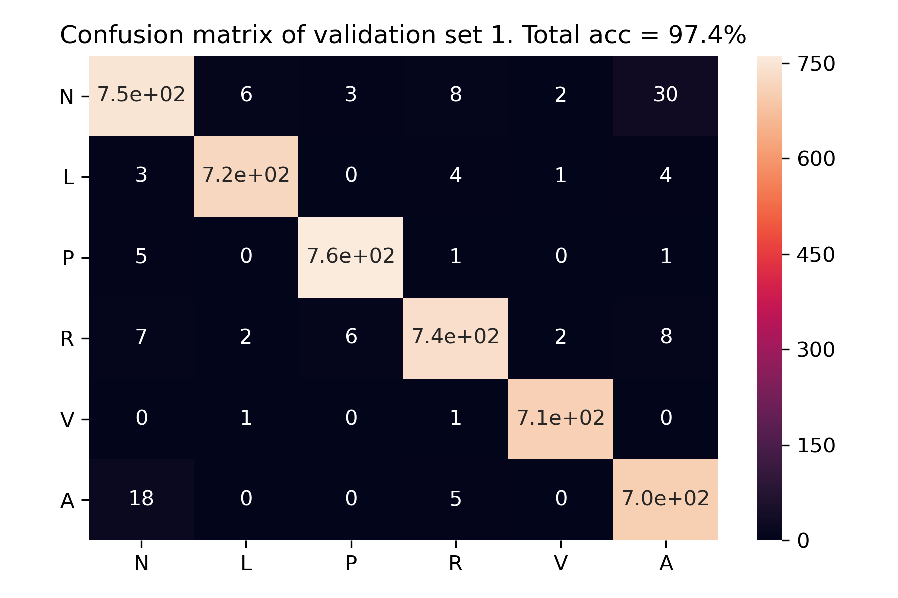
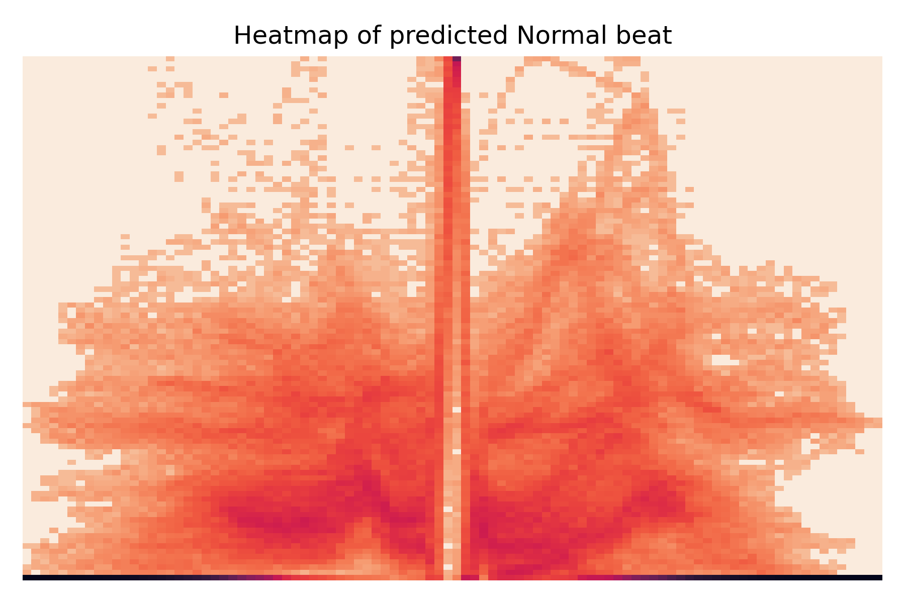
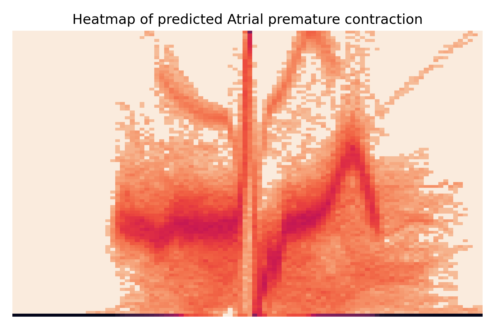

# Heartbeat prediction with Python (Keras)

For the complete report please refer to [here](https://github.com/jerchiury/heartbeat_python/blob/master/heartbeat_python.md)

I set out to predict 6 most frequent types of heartbeats given ECG graphs using neural network. The training data are annotated by cardiologists. The final accuracy of the deep learning model is around 96.8%. Data comes from the [MIT-BIH Arrhythmia Database](https://www.physionet.org/content/mitdb/1.0.0/).

## A ver short window of the ECG graphs we are dealing with with added annotation markers

## The beat types we have, we are predicting the top 6 most frequent

    Normal beat                                 74110  67.171214
    Left bundle branch block beat                8046   7.292667
    Paced beat                                   7020   6.362730
    Right bundle branch block beat               6846   6.205021
    Premature ventricular contraction            6734   6.103508
    Atrial premature contraction                 2256   2.044775
    Rhythm change                                1241   1.124807
    Fusion of paced and normal beat               982   0.890057
    Fusion of ventricular and normal beat         799   0.724191
    Signal quality change                         605   0.548355
    Ventricular flutter wave                      472   0.427807
    Comment annotation                            434   0.393365
    Nodal (junctional) escape beat                215   0.194870
    Isolated QRS-like artifact                    132   0.119641
    Aberrated atrial premature beat               107   0.096982
    Ventricular escape beat                        97   0.087918
    Non-conducted P-wave (blocked APB)             90   0.081573
    Nodal (junctional) premature beat              82   0.074322
    Unclassifiable beat                            32   0.029004
    Atrial escape beat                             16   0.014502
    Start of ventricular flutter/fibrillation       6   0.005438
    End of ventricular flutter/fibrillation         6   0.005438
    Premature or ectopic supraventricular beat      2   0.001813

## Cutting each heartbeat out of the ECG's and padding them with 0's

## Results of the deep learning:

