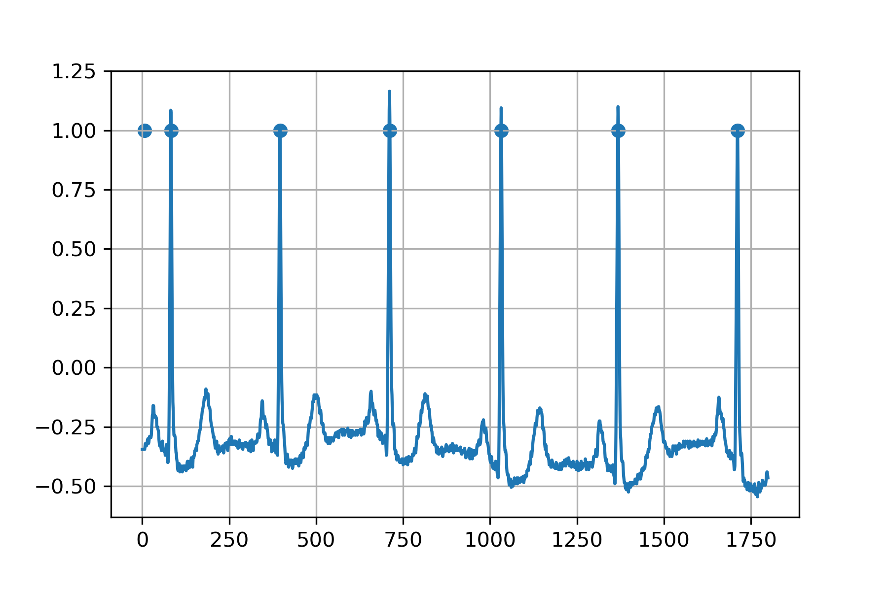
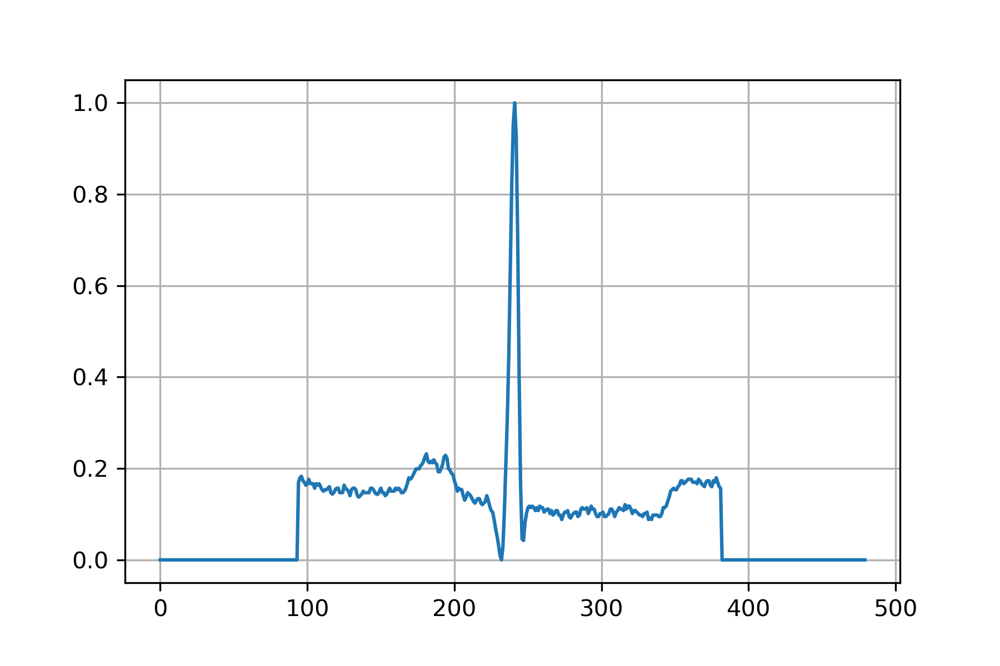
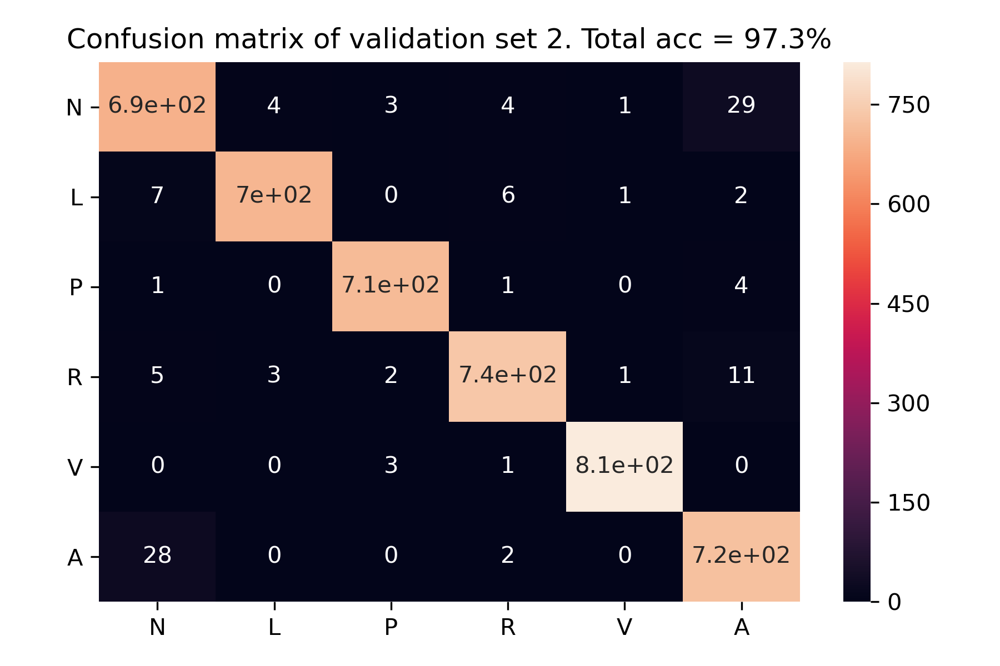
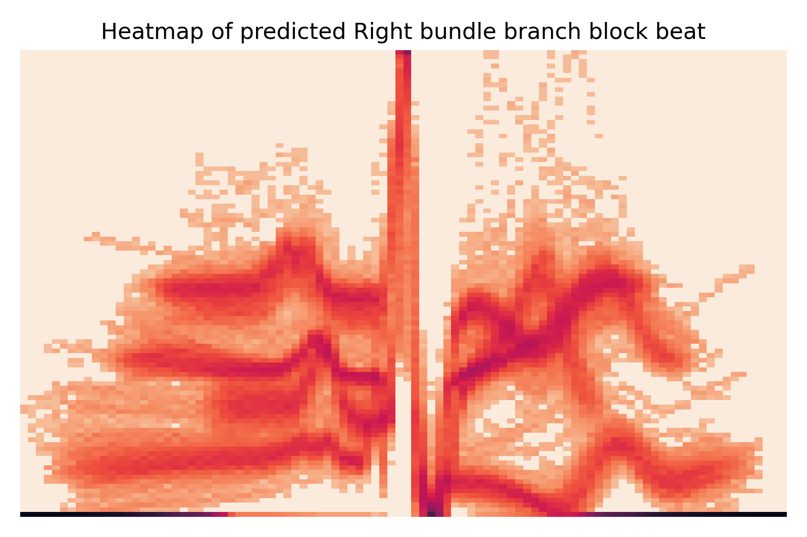
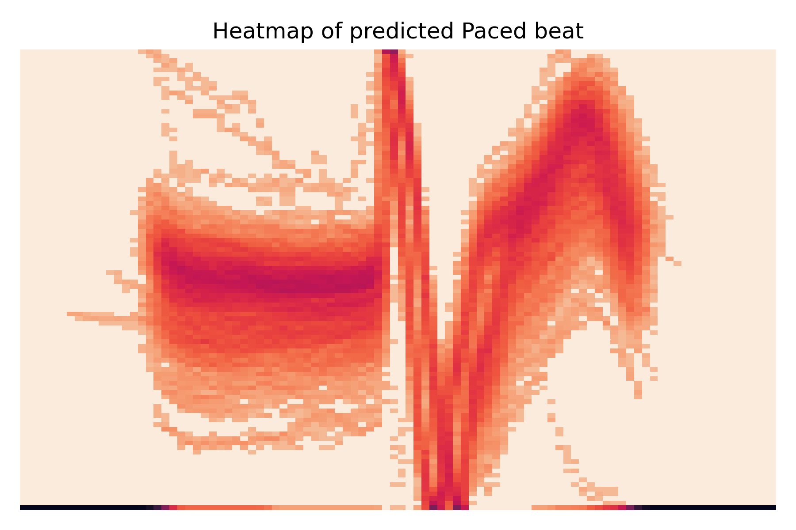

# Heartbeat prediction with Python (Keras)

I set out to predict 6 most frequent types of heartbeats given ECG graphs using neural network. The training data are annotated by cardiologists. The final accuracy of the deep learning model is around 97.4%. Data comes from the [MIT-BIH Arrhythmia Database](https://www.physionet.org/content/mitdb/1.0.0/). Special python package wfdb was used to read the ecg samples and annotations. 

``` python
import os
import wfdb
import matplotlib.pyplot as plt
import numpy as np
import pandas as pd
import tensorflow as tf
from tensorflow import keras
from tensorflow.keras import layers
from sklearn.metrics import confusion_matrix
import seaborn as sn
os.chdir('C:\\Users\\Jerry\\Desktop\\Jerry\\projects\\heartbeat_python')
```

download all the files

``` python
test=wfdb.get_dbs()
wfdb.get_record_list('mitdb')
wfdb.dl_database('mitdb', 'C:\\Users\\Jerry\\Desktop\\Jerry\\projects\\Heartbeat Python\\data')

#%% building a loop to read in data and annotations
def simple_plot(x, alpha=1, grid=True):
    plt.plot(np.arange(0,len(x)),x, alpha=alpha)
    if grid:
        plt.grid(True)

sample=wfdb.rdsamp('data\\101')[0][:,0] # read in the record

annotation=wfdb.rdann('data\\101', 'atr', return_label_elements=['description']) # read in the annotation
annotation=pd.DataFrame({'sample_num':annotation.sample, 'desc':annotation.description})
```
# visualizing the first ecg sample and the first 6 beats
simple_plot(sample[0:1800,])
plt.scatter(annotation.sample_num[0:6], [1]*6)




# identifying the point to cut the heartbeats

``` python
beat_length=480 # set each beat data to 1.33 second long

def between_point(x, c):
    temp=x[0]+c*(x[1]-x[0])
    return(int(np.floor(temp)))

def cut_data(x, ann, total_len):
    result=[]
    beat_type=[]
    upper_bound=between_point((ann.sample_num[1], ann.sample_num[2]), cut_ratio)
    mid_point=int(np.floor(total_len/2))
    for i in range(2, len(ann.sample_num)-1):
        lower_bound=upper_bound
        upper_bound=between_point((ann.sample_num[i], ann.sample_num[i+1]), cut_ratio)
        temp=x[lower_bound:upper_bound]
        
        # rescale
        temp=temp-min(temp)
        temp=temp/max(temp)
        
        # padding
        temp=np.insert(temp, 0, [0]*(mid_point-ann.sample_num[i]+lower_bound))
        temp=np.append(temp, [0]*(mid_point-upper_bound+ann.sample_num[i]))
        
        #adding to list
        if len(temp)==total_len:
            result.append(temp)
            beat_type.append(ann.desc[i])
    return(result, beat_type)

test=cut_data(sample, annotation.sample_num, 540)

for i in (1, 10, 429, 653, 1546):
    if i>100:
        alpha=0.5
    else:
        alpha=1
    simple_plot(test[i], alpha=alpha)

simple_plot(test[1])
```

#Now we've done one case, it's time to extract all cases

``` python
record_list=wfdb.get_record_list('mitdb')
record_list=[n for n in record_list if n not in ('102','104','114')] #remove the ecg's that is not from MLII

heart_beats=[]
beat_type=[]
cut_ratio=0.5
beat_length=480 # set each beat data to 1.5 second long, 1.5 seconds per beat is 40 bpm

for i in record_list:
    print(i)
    sample=wfdb.rdsamp('data\\'+str(i))[0][:,0] # read in the record

    annotation=wfdb.rdann('data\\'+str(i), 'atr', return_label_elements=['description']) # read in the annotation
    annotation=pd.DataFrame({'sample_num':annotation.sample, 'desc':annotation.description})
    temp=cut_data(sample, annotation, beat_length)
    heart_beats=heart_beats+temp[0]
    beat_type=beat_type+temp[1]

heart_beats=pd.DataFrame({'ecg':heart_beats, 'beat_type':beat_type})
```

#All the beats are in, around 100000 beats, let's do some simple exploration

``` python
beat_type_count=pd.Series(beat_type).value_counts()
beat_type_count=pd.DataFrame({'freq':beat_type_count, 'prop':beat_type_count/sum(beat_type_count)*100})
```

                                                 freq       prop
    Normal beat                                 72058  69.285206
    Left bundle branch block beat                8046   7.736390
    Right bundle branch block beat               6846   6.582566
    Premature ventricular contraction            6712   6.453722
    Paced beat                                   3616   3.476856
    Atrial premature contraction                 2246   2.159574
    Rhythm change                                1191   1.145170
    Fusion of ventricular and normal beat         795   0.764408
    Signal quality change                         561   0.539413
    Ventricular flutter wave                      472   0.453837
    Comment annotation                            434   0.417300
    Fusion of paced and normal beat               260   0.249995
    Nodal (junctional) escape beat                215   0.206727
    Isolated QRS-like artifact                    131   0.125959
    Aberrated atrial premature beat               107   0.102883
    Ventricular escape beat                        97   0.093267
    Non-conducted P-wave (blocked APB)             90   0.086537
    Nodal (junctional) premature beat              81   0.077883
    Atrial escape beat                             16   0.015384
    Unclassifiable beat                            14   0.013461
    End of ventricular flutter/fibrillation         6   0.005769
    Start of ventricular flutter/fibrillation       6   0.005769
    Premature or ectopic supraventricular beat      2   0.001923



#%%
# We are gonna do deep learning on the top 6 types of beats.

    #'Normal beat', 
    #'Left bundle branch block beat',
    #'Right bundle branch block beat', 
    #'Premature ventricular contraction',
    #'Paced beat'
    # looks like we have to downsample the data in order to do modelling. 

``` python
beat_type_count.index[0:6]


# filter out the other beats
heart_beats=heart_beats.loc[heart_beats['beat_type'].isin(beat_type_count.index[0:6])]
pd.Series(heart_beats.beat_type).value_counts()
beat_type_count['code']=np.arange(0, len(beat_type_count))

# random rample, we down sample each beat to 2500 samples
dataset=heart_beats.groupby('beat_type').apply(lambda x: x.sample(3000, replace=True))
dataset = dataset.sample(frac=1).reset_index(drop=True)
dataset.beat_type=[beat_type_count.code[beat_type_count.index.values==n][0] for n in dataset.beat_type]

def train_test(x ,frac):
    temp=int(np.floor(len(x)))
    return([x[0:int(temp*frac)], x[int(temp*frac):temp]])

val, train=train_test(dataset, 0.5) # split validation set and the training set

# split train set and test set for the NN 3:1
train, test=train_test(train, 0.75) 
xtrain=pd.DataFrame(train.ecg.values.tolist())
ytrain=train.beat_type
xtest=pd.DataFrame(test.ecg.values.tolist())
ytest=test.beat_type

#split the validation sets into 2 equal sets
val1, val2=train_test(val, 0.5)
xval1=pd.DataFrame(val1.ecg.values.tolist())
yval1=val1.beat_type
xval2=pd.DataFrame(val2.ecg.values.tolist())
yval2=val2.beat_type

#%% now the data is prepared, we can proceed to modelling
inputs = keras.Input(shape=(480,), name="ecg")
x = layers.Dense(64, activation="relu", name="dense_1")(inputs)
x = layers.Dense(64, activation="relu", name="dense_2")(x)
outputs = layers.Dense(6, activation="softmax", name="predictions")(x)

model = keras.Model(inputs=inputs, outputs=outputs)

model.compile(
    optimizer=keras.optimizers.RMSprop(),  # Optimizer
    # Loss function to minimize
    loss=keras.losses.SparseCategoricalCrossentropy(),
    # List of metrics to monitor
    metrics=[keras.metrics.SparseCategoricalAccuracy()],
)

history = model.fit(
    xtrain,
    ytrain,
    batch_size=50,
    epochs=20,
    # We pass some validation for
    # monitoring validation loss and metrics
    # at the end of each epoch
    validation_data=(xtest, ytest),
)


# 1-letter label for each type
beat_label=['N', 'L', 'P', 'R', 'V', 'A']

# total accuracy from confusion matrix
def total_acc(cm):
    return(cm.max().to_frame().T.div(cm.sum(axis=1)).T.mean())
```

# validation on val sets

``` python
pred1=model.predict(xval1).argmax(axis=1)
cm1=confusion_matrix(yval1, pred1)
cm1=pd.DataFrame(cm1, index = beat_label, columns = beat_label)
sn.heatmap(cm1, annot=True)
plt.yticks(rotation=0)
plt.title('Confusion matrix of validation set 1. Total acc = 97.4%')
plt.tight_layout()
plt.savefig('cm_val1.png', format='png', dpi=300)
total_acc(cm1) #97.4%!
```


``` python
pred2=model.predict(xval2).argmax(axis=1)
cm2=confusion_matrix(yval2, pred2)
cm2=pd.DataFrame(cm2, index = beat_label, columns = beat_label)
sn.heatmap(cm2, annot=True)
plt.yticks(rotation=0)
plt.title('Confusion matrix of validation set 2. Total acc = 97.3%')
plt.tight_layout()
plt.savefig('cm_val2.png', format='png', dpi=300)
total_acc(cm2) #97.3%!

model.save('heart_beat_model.h5')
```



# plotting the results from the xval1 set with the prediction by beat type

``` python
pred1=model.predict(xval1).argmax(axis=1)

def plot_multiple(x, n, alpha):
    temp=x.sample(n).reset_index(drop=True)
    for i in range(0, len(temp)):
        simple_plot(temp.loc[i], alpha=alpha)

one_type=xval1.loc[[i for i in range(0, len(pred1)) if pred1[i]==3]]
plot_multiple(one_type, 5, 0.5)

temp=one_type.loc[1:30]
sn.heatmap(temp)

def line_heatmap(x, title):
    temp=x.melt()
    temp['variable']=temp['variable']//5*5
    temp['value']=temp['value']//0.01*0.01
    temp=pd.crosstab(temp.value, temp.variable)
    temp=temp**(0.2)
    temp.sort_values(by=['value'], inplace=True, ascending=False)
    sn.heatmap(temp, cmap=sn.cm.rocket_r, xticklabels=False, yticklabels=False, cbar=False)
    plt.xlabel("") 
    plt.ylabel("")
    plt.title(title)
    
beat_label=['N', 'L', 'P', 'R', 'V', 'A']
for n in range(0,6):
    one_type=xval1.loc[[i for i in range(0, len(pred1)) if pred1[i]==n]]
    beat_index=beat_type_count.index[beat_type_count.code==n][0]
    line_heatmap(one_type, 'Heatmap of predicted '+beat_index)
    plt.tight_layout()
    plt.savefig('heatmap_'+beat_label[n]+'.png', format='png', dpi=300)
    plt.show()
```







